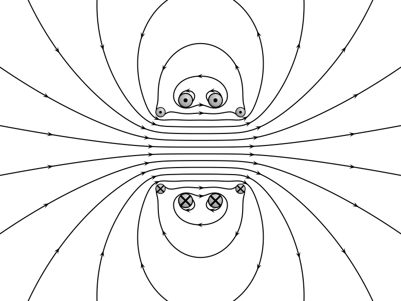

# 🧲 Tetracoil Magnetic Field Visualisation

[](https://www.python.org/)
[](LICENSE.md)
[](https://warwick.ac.uk/)
[](https://github.com/topics/research)
[](https://en.wikipedia.org/wiki/Electromagnetic_field)
[](output/VFPt_tetracoil.svg)

A Python implementation for visualising magnetic field patterns of tetracoil configurations using VectorFieldPlot, designed for electromagnetic field analysis and research applications.

## 📊 Generated Output

The script produces high-quality magnetic field visualisations showing the characteristic field line patterns of the tetracoil system:



_Figure: Magnetic field lines generated by the tetracoil configuration, showing the uniform central field region and characteristic field line topology._

## 🔬 Overview

This repository contains code to generate magnetic field visualisations for tetracoil systems based on the four-coil exposure system described in Gottardi et al. (2003). The tetracoil configuration is designed to produce highly uniform magnetic fields, making it valuable for bioelectromagnetic research and electromagnetic field studies.

The implementation uses the VectorFieldPlot library to compute accurate field line representations and generate publication-quality visualisations suitable for scientific documentation and research presentations.

## ✨ Features

- **High-Quality Visualisation**: Generates publication-ready SVG magnetic field plots with customisable styling
- **Scientifically Accurate**: Implements tetracoil configuration based on peer-reviewed research parameters
- **Uniform Field Generation**: Optimised for creating uniform magnetic field regions suitable for experimental applications
- **Precise Positioning**: Coil positioning based on validated research parameters from Gottardi et al. (2003)
- **Customisable Output**: Adjustable field line density, arrow styling, and visualisation parameters

## 🚀 Quick Start

### Installation

1. Clone the repository:

```bash
git clone https://github.com/AdzCoder/tetracoil-field-visualisation.git
cd tetracoil-field-visualisation
```

2. Install required dependencies:

```bash
pip install -r requirements.txt
```

### Usage

Run the visualisation script:

```bash
python src/tetracoil_field.py
```

The generated SVG file will be saved to the directory.

### Customisation

Modify the parameters in `tetracoil_field.py` to adjust:

- Field line density
- Visualisation region
- Coil positioning
- Arrow styling
- Output resolution

## 📋 Requirements

- **Python**: 3.6 or higher
- **VectorFieldPlot**: For field line computation and visualisation
- **NumPy**: For numerical computations
- **SciPy**: For scientific computing functions

Install all dependencies with:

```bash
pip install vectorfieldplot numpy scipy
```

## 📄 Licensing

This project uses dual licensing to accommodate both open-source development and academic use:

- **Source Code** (`tetracoil_field.py`): [GNU General Public License v3.0](LICENSES\GPL-3.0.txt)
- **Generated Visualisations** (`VFPt_tetracoil.svg`): [Creative Commons Attribution 4.0](LICENSES\CC-BY-4.0.txt)

## 📖 Citation

If you use this code in your research, please cite:

```bibtex
@software{bhatti2025tetracoil,
  author = {Bhatti, Adil Wahab},
  title = {Tetracoil Magnetic Field Visualisation},
  year = {2025},
  url = {https://github.com/AdzCoder/tetracoil-field-visualisation},
  version = {1.0.0}
}
```

## 📚 References

- Gottardi, G., Mesirca, P., Agostini, C., Remondini, D., & Bersani, F. (2003). A four coil exposure system (tetracoil) producing a highly uniform magnetic field. _Bioelectromagnetics_, 24(2), 125-133. [DOI: 10.1002/bem.10074](https://doi.org/10.1002/bem.10074)
- VectorFieldPlot by Geek3: [Wikimedia Commons](https://commons.wikimedia.org/wiki/User:Geek3/VectorFieldPlot)

## 🤝 Contributing

Contributions are welcome! Please feel free to submit a Pull Request for:

- 🐛 Bug fixes and improvements
- ✨ New features and enhancements
- 📚 Documentation improvements
- 🧪 Additional test cases and validation
- 🎨 Visualisation enhancements

### Development Guidelines

1. Fork the repository
2. Create a feature branch (`git checkout -b feature/amazing-feature`)
3. Commit your changes (`git commit -m 'Add amazing feature'`)
4. Push to the branch (`git push origin feature/amazing-feature`)
5. Open a Pull Request

## 📧 Contact

- **Author**: Adil Wahab Bhatti
- **GitHub**: [@AdzCoder](https://github.com/AdzCoder)
- **Institution**: University of Warwick

## 🙏 Acknowledgments

- University of Warwick for research support
- Gottardi et al. for the original tetracoil research
- The VectorFieldPlot library developers for the visualisation framework
- The scientific computing community for the underlying numerical libraries

---

_This project is part of ongoing research in electromagnetic field analysis at the University of Warwick._
