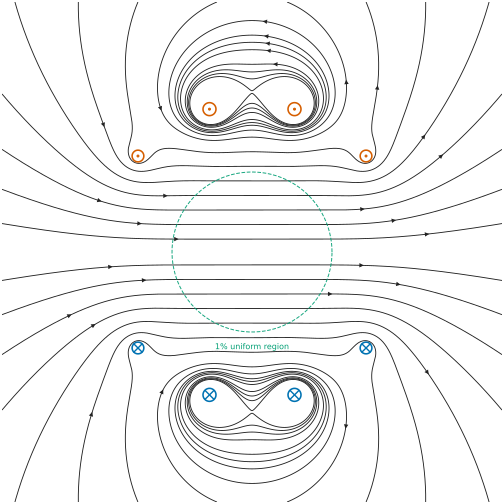

# 🧲 Tetracoil Magnetic Field Visualisation

[](https://www.python.org/)
[](LICENSE.md)
[](https://warwick.ac.uk/)
[](https://github.com/topics/research)
[](https://en.wikipedia.org/wiki/Electromagnetic_field)
[](output/tetracoil_field_lines.svg)

A self-contained Python implementation (numpy + matplotlib only) for visualising the magnetic field of the tetracoil configuration. Field lines are exact: contours of the stream function computed in closed form via elliptic integrals, with flux-true spacing and field-direction arrowheads, in an Okabe-Ito colour-blind-safe palette.

## 📊 Generated Output

The script produces high-quality magnetic field visualisations showing the characteristic field line patterns of the tetracoil system:



_Figure: Magnetic field lines generated by the tetracoil configuration, showing the uniform central field region and characteristic field line topology._

## 🔬 Overview

This repository contains code to generate magnetic field visualisations for tetracoil systems based on the four-coil exposure system described in Gottardi et al. (2003). The tetracoil configuration is designed to produce highly uniform magnetic fields, making it valuable for bioelectromagnetic research and electromagnetic field studies.

The tetracoil is the single-sphere two-pair coil system whose angular positions (40.09°, 73.43°) are the fourth-order cancellation roots found by Fanselau (1929); the sphere-constrained solution with ampere-turn ratio 0.68211 cancels the 2nd, 4th and 6th order field terms (8th-order system) and appears in Garrett (1951) and Fiorillo (2005, Ch. 4, as the "double Helmholtz coil"). Gottardi et al. (2003) first realised it physically and coined the name "tetracoil", using the integer ampere-turn ratio 73:107.

Field lines in the meridian plane of an axisymmetric system are level sets of the stream function psi = rho*A_phi, which this implementation evaluates in closed form via complete elliptic integrals (AGM method). Contour levels are chosen so lines cross the midplane at evenly spaced heights, making line spacing flux-true: the even spacing in the bore is itself a visualisation of the field uniformity. Output is publication-quality SVG and PNG.

## ✨ Features

- **High-Quality Visualisation**: Generates publication-ready SVG magnetic field plots with customisable styling
- **Scientifically Accurate**: Implements tetracoil configuration based on peer-reviewed research parameters
- **Uniform Field Generation**: Optimised for creating uniform magnetic field regions suitable for experimental applications
- **Precise Positioning**: Coil positioning based on validated research parameters from Gottardi et al. (2003)
- **Customisable Output**: Adjustable field line density, arrow styling, and visualisation parameters

## 🚀 Quick Start

### Installation

1. Clone the repository:

```bash
git clone https://github.com/AdzCoder/tetracoil-field-visualisation.git
cd tetracoil-field-visualisation
```

2. Install required dependencies:

```bash
pip install -r requirements.txt
```

### Usage

Run the visualisation script:

```bash
python src/tetracoil_field.py
```

SVG and PNG are written to `output/`.

### Customisation

Modify the parameters in `tetracoil_field.py` to adjust:

- Field line density
- Visualisation region
- Coil positioning
- Arrow styling
- Output resolution

## 📋 Requirements

- **Python**: 3.8 or higher
- **NumPy** and **Matplotlib** — nothing else

```bash
pip install -r requirements.txt
```

## 📄 Licensing

This project uses dual licensing to accommodate both open-source development and academic use:

- **Source Code** (`src/tetracoil_field.py`): [MIT](LICENSES/MIT.txt)
- **Generated Visualisations** (`output/`): [Creative Commons Attribution 4.0](LICENSES/CC-BY-4.0.txt)

## 📖 Citation

If you use this code in your research, please cite:

```bibtex
@software{bhatti2025tetracoil,
  author = {Bhatti, Adil Wahab},
  title = {Tetracoil Magnetic Field Visualisation},
  year = {2025},
  url = {https://github.com/AdzCoder/tetracoil-field-visualisation},
  version = {2.0.0}
}
```

## 📚 References

- Gottardi, G., Mesirca, P., Agostini, C., Remondini, D., & Bersani, F. (2003). A four coil exposure system (tetracoil) producing a highly uniform magnetic field. _Bioelectromagnetics_, 24(2), 125-133. [DOI: 10.1002/bem.10074](https://doi.org/10.1002/bem.10074)
- Fanselau, G. (1929). Die Erzeugung weitgehend homogener Magnetfelder durch Kreisströme. _Zeitschrift für Physik_, 54, 260-269. [DOI: 10.1007/BF01339844](https://doi.org/10.1007/BF01339844)
- Garrett, M.W. (1951). Axially symmetric systems for generating and measuring magnetic fields. _Journal of Applied Physics_, 22(9), 1091-1107. [DOI: 10.1063/1.1700115](https://doi.org/10.1063/1.1700115)
- Fiorillo, F. (2005). Chapter 4 — Magnetic Field Sources. In _Characterization and Measurement of Magnetic Materials_. Elsevier. [DOI: 10.1016/B978-012257251-7/50006-X](https://doi.org/10.1016/B978-012257251-7/50006-X)

## 🤝 Contributing

Contributions are welcome! Please feel free to submit a Pull Request for:

- 🐛 Bug fixes and improvements
- ✨ New features and enhancements
- 📚 Documentation improvements
- 🧪 Additional test cases and validation
- 🎨 Visualisation enhancements

## 📧 Contact

- **Author**: Adil Wahab Bhatti
- **GitHub**: [@AdzCoder](https://github.com/AdzCoder)
- **Institution**: University of Warwick

## 🙏 Acknowledgments

- University of Warwick for research support
- Gottardi et al. for the original tetracoil research
- The scientific computing community for the underlying numerical libraries
